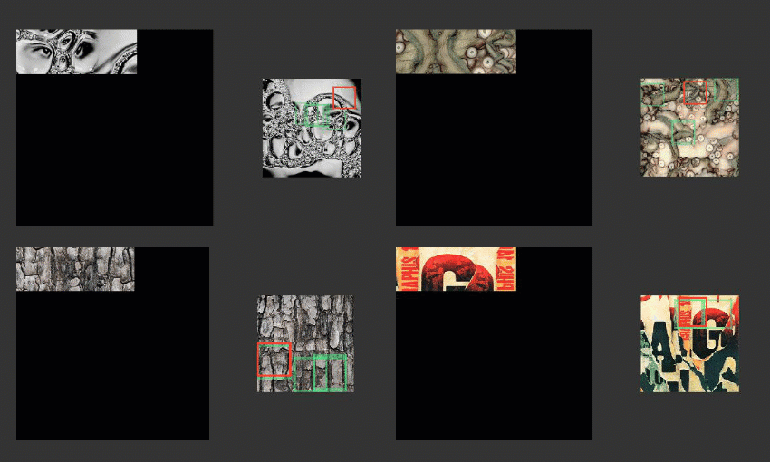

# patch-based-texture-synthesis
Based on "Image Quilting for Texture Synthesis and Transfer" and "Real-Time Texture Synthesis by Patch-Based Sampling" papers

### Python

Here are the libraries and their versions you will need:
* Python 3.7
* Jupyter Notebook (5.6.0)
* Numpy (is 1.15.1)
* Matplotlib (2.2.3)
* Scipy (1.1.0)
* Skimage (0.14.0)
* scikit-learn (0.19.2)
* imageio (2.4.1)
* PIL (5.2.0)

To start, open the Jupyter Notebook file "Patch-based Texture Synthesis", and follow the instructions :) 

Below you can see the effect of different patch sizes:

